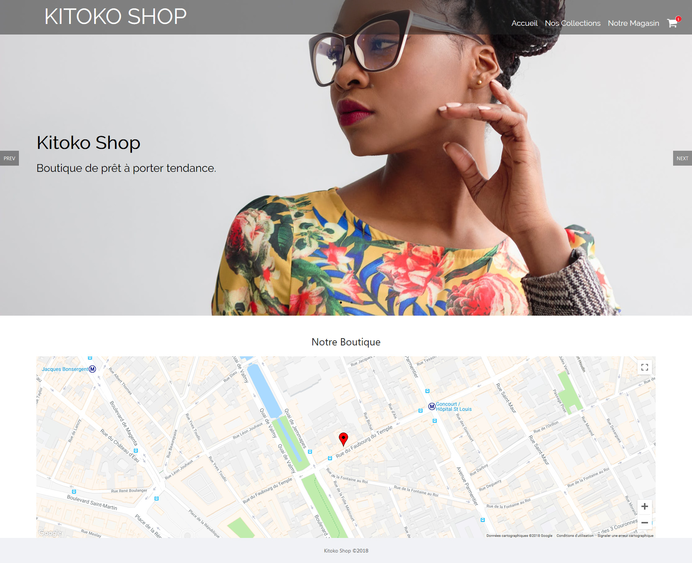
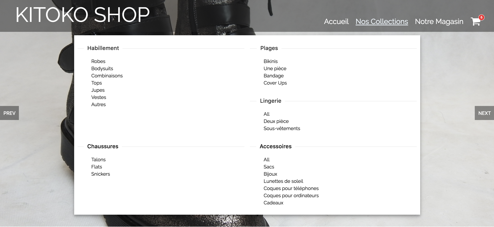

# Kitoko Shop (React)

## Captures d'écran du site web

## Installation des prérequis

### Installation de npm

La première étape est d'installer npm sur votre machine. Pour cela, vous devez télécharger et installer Node.js. Vous trouverez les liens de téléchargement à cette adresse. Pour les systèmes Debian et Ubuntu, vous pouvez également exécuter la commande suivante :

	sudo apt-get install nodejs npm

### Téléchargement du dépôt

Vous devez maintenant télécharger le corps de l'application. Pour cela, effectuez une copie de ce répertoire git avec la commande suivante :

	git clone https://git.charles-rio.ovh/Charles_RIO/Kitoko_shop.git

Téléchargement des packages

Une fois npm installé et l'application téléchargée, il vous faut maintenant télécharger tous les packages npm utilisés par l'application.

	npm install

On lance ensuite l'application :

	npm start

Il suffit désormais de se rendre à l'adresse suivante : <http://localhost:8000> pour visualiser le site web.